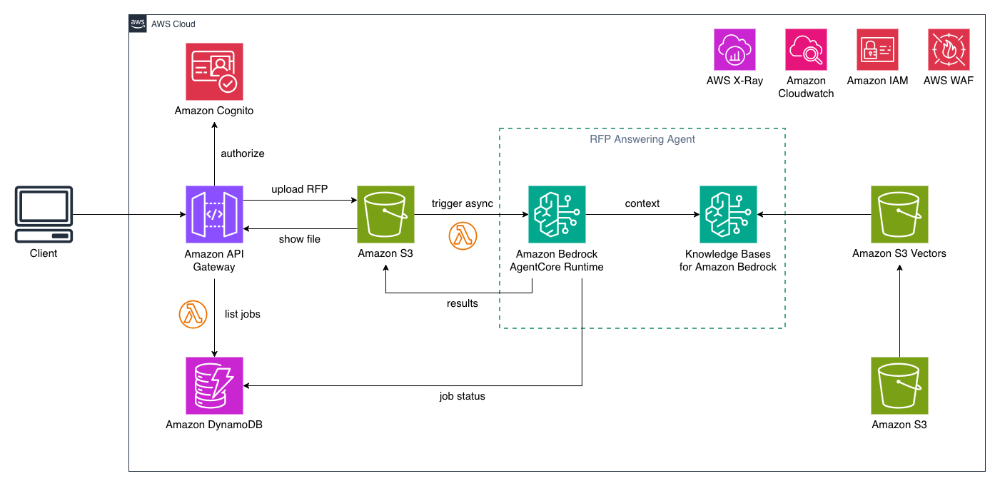

# RFP Answers With Generative AI

## Overview

This project is an example of how you can leverage existing company documents to automate responses to a Request for Proposal (RFP) document.

An RFP is a business document sent from an organization requiring bids from contractors for a particular project. A large number of organizations, including governments, launch their projects using RFPs. The organization requesting the RFP is responsible for evaluating the feasibility of the bids submitted, the financial health of the bidding companies, and each bidder's ability to undertake the project.

The project is powered by Large Language Models (LLM) available on Amazon Bedrock. These LLMs are used to perform advanced natural language tasks, such as extracting data from previous RFPs and leveraging existing company knowledge to answer questions.

## Architecture



The solution is divided into 2 stacks: Ingestion and Inference. Additionally, this project provides you with a sample front-end application that allows you to upload and process new RFPs, and interact with the answers provided by the LLM.

You can also inspect the solution [data flow](docs/images/data-flow.png).

### Ingestion stack

The ingestion stack uses Knowledge Bases and Amazon S3 Vectors to deploy a fully-managed data ingestion pipeline powered by Anthropic Claude LLMs.

This project assumes that, when generating RFP answers, the user may use one of two types of supporting documentation: previous RFPs in the form of CSV and XLSX files, and other company knowledge in the form of PDF documents. The solution does not require you to use both types of documents to generate answers.

An authorized user can upload the documents to the buckets by an authorized user using the [Amazon Simple Storage Service (Amazon S3) Console](https://console.aws.amazon.com/s3/home) and/or [AWS Command Line Interface (AWS CLI)](https://aws.amazon.com/cli/).

Components deployed by this stack include:

- **4 Amazon S3 buckets:** one for previously answered RFP files (CSV/XLSX), one for company documents (PDF), one for custom transformations outputs, and a logging bucket
- **An AWS Lambda function** that performs custom transformations during the ingestion of RFP files
- **2 Amazon S3 Vectors Indexes:** one for RFP files, other for documents
- **2 Knowledge Bases for Amazon Bedrock** syncing the contents of each data bucket into the respective S3 Vectors index

### Inference stack

The inference stack configures a workflow for processing new, incoming RFPs. It breaks the RFP down into questions, then prompts the LLM to use context from the Knowledge Base (which is deployed in the ingestion stack) to answer each question.

The generated answer and the original question are saved into an Amazon DynamoDB table.

Components deployed by this stack include:

- **2 Amazon S3 buckets:** one for new RFP files that is processed (CSV/XLSX), and a logging bucket
- **An Amazon Bedrock Agents runtime agent** that will run the RFP Answering Agent Flow
- **An Amazon DynamoDB table** to record the RFP file uploads and answering jobs
- **An Amazon API Gateway serverless API** to interact with the RFP files processed by the application
- **3 AWS Lambda functions** to execute the API logic for each of the 3 routes
- **An AWS WAF web ACL** to protect the API against common exploits
- **An Amazon Cognito user and identity pool** to authenticate requests to the API

### Demo Web Application

This sample includes a demo web application that showcases how you can interact with the RFP responses generated by the agent. 

> We do not recommend having this web application in production or publicly accessible as-is. The user interface was created for demo purposes only. The work is provided **AS IS** without warranties or conditions of any kind, either express or implied, including warranties or conditions of merchantability. You bear the risks of using the package.

## Folder Structure

This sample application codebase is organized into these key folders:

```
samples/rfp-answer-generation
│
├── backend             # Backend architecture CDK project
├── docs                # Sample RFPs and docs, additional project documentation.
└── frontend            # Frontend sample application
```

## Getting started

> **Warning**
> This sample allows you to interact with models from third party providers. Your use of the third-party generative AI (GAI) models is governed by the terms provided to you by the third-party GAI model providers when you acquired your license to use them (for example, their terms of service, license agreement, acceptable use policy, and privacy policy).

> You are responsible for enabling that your use of the third-party GAI models comply with the terms governing them, and any laws, rules, regulations, policies, or standards that apply to you.

> You are also responsible for making your own independent assessment of the third-party GAI models that you use, including their outputs and how third-party GAI model providers use any data that might be transmitted to them based on your deployment configuration. AWS does not make any representations, warranties, or guarantees regarding the third-party GAI models, which are "Third-Party Content" under your agreement with AWS. This sample is offered to you as "AWS Content" under your agreement with AWS.

To deploy this project, follow the [instructions available in the `backend` folder](backend/README.md). Once the stack is deployed, follow [the instructions available in the usage documentation](docs/usage.md) to interact with the application.

## Guardrails

LLM applications are subject to novel class of security threats, such as those described in the [OWASP Top 10 for LLM Applications](https://owasp.org/www-project-top-10-for-large-language-model-applications/).

We recommend you dive deeper into both the [security model of the Amazon Bedrock platform](https://docs.aws.amazon.com/bedrock/latest/userguide/security.html) and security model for LLMs in general.

LLMs are succeptible to [prompt injection and jailbreaking](https://simonwillison.net/2024/Mar/5/prompt-injection-jailbreaking/), which manipulate a large language model (LLM) through crafty inputs, causing unintended actions by the LLM. Direct injections overwrite system prompts, while indirect ones manipulate inputs from external sources.

As a recommendation you can apply guardrails to the inputs to LLM.

This project uses Anthropic Claude models which have been shown by some benchmarks to be more robust against this type of attack.

To learn more about how to configure guardrails, refer to https://aws.amazon.com/bedrock/guardrails/.

## Security recomendations

For security recommendations when deploying this project, see [Security](docs/security.md).

# Content Security Legal Disclaimer

The sample code; software libraries; command line tools; proofs of concept; templates; or other related technology (including any of the foregoing that are provided by our personnel) is provided to you as AWS Content under the AWS Customer Agreement, or the relevant written agreement between you and AWS (whichever applies). You should not use this AWS Content in your production accounts, or on production or other critical data. You are responsible for testing, securing, and optimizing the AWS Content, such as sample code, as appropriate for production grade use based on your specific quality control practices and standards. Deploying AWS Content may incur AWS charges for creating or using AWS chargeable resources, such as running Amazon EC2 instances or using Amazon S3 storage.


# Operational Metrics Collection

Generative AI CDK Constructs samples may collect anonymous operational metrics, including: the region a construct is deployed, the name and version of the construct deployed, and related information. We may use the metrics to maintain, provide, develop, and improve the constructs and AWS services.
